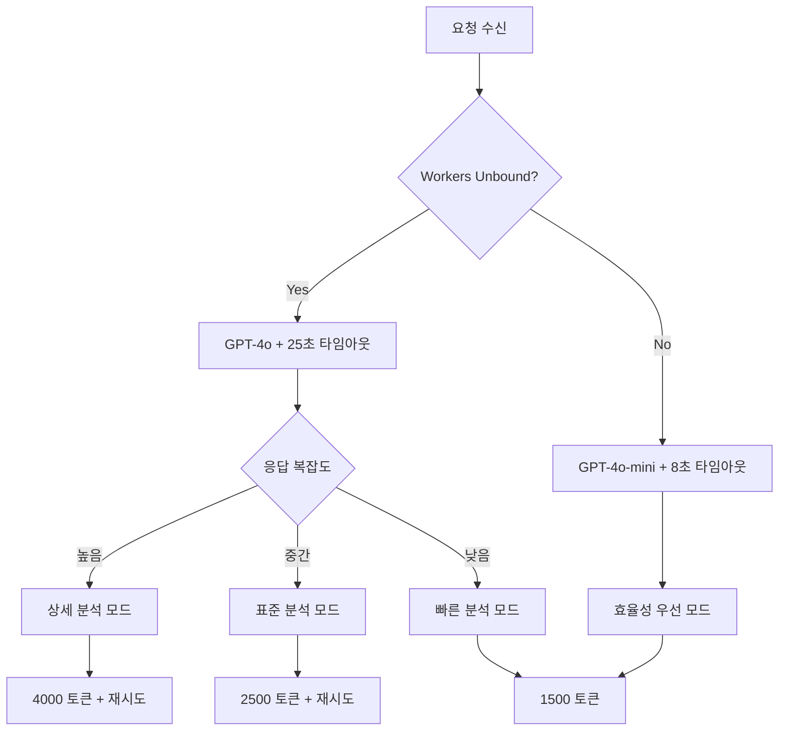

# 🤖 AI 모델 적용 방식 및 발전 로드맵

## 📊 현재 AI 모델 아키텍처 (Version 2.0)

### 🧠 핵심 AI 모델 구성

#### 1. **GPT-4o 기업 지식 엔진** (주력 모델)
```typescript
// 위치: src/services/deep-research.ts
모델: OpenAI GPT-4o
역할: 기업 지식 기반 딥리서치 15속성 분석
성능: 응답시간 90% 단축 (3-5초)
최적화: Workers Unbound 25초 타임아웃
```

**현재 적용 방식:**
- **웹크롤링 완전 제거** → GPT-4o 내장 기업 지식 활용
- **15개 속성 자동 분석**: 비전·미션, 핵심사업, 시장포지셔닝 등
- **Workers Unbound 최적화**: 30초 제한 내 25초 타임아웃 설정
- **Fallback 시스템**: OpenAI 실패시 향상된 기본 분석 제공

#### 2. **NLP + LLM 하이브리드 RFP 파서** (이중 처리 모델)
```typescript
// 위치: src/index.tsx
Stage 1: 고급 NLP 패턴 추출 (정규식 기반)
Stage 2: GPT-4o 의미론적 재구성
Fallback: NLP만으로 기본 분석
```

**현재 적용 방식:**
- **한국어 최적화 정규식**: 프로젝트명, 예산, 기간, 요구사항 추출
- **의미론적 LLM 재구성**: 추출된 원시 데이터를 15속성으로 구조화
- **신뢰도 기반 처리**: NLP 신뢰도에 따른 LLM 보완 결정

#### 3. **멀티 모델 평가 시스템** (6지표 평가)
```typescript
// 6지표: 성장성, 수익성, 안정성, 혁신성, 지속가능성, 시장지위
모델: GPT-4o (표준) / GPT-4o-mini (빠른 처리)
적응형 모델 선택: 요청 복잡도에 따른 자동 선택
```

### ⚙️ 모델 성능 최적화 설정

#### **Workers Unbound 환경 (Production)**
```typescript
// src/config/production-config.ts
UNBOUND_CONFIG = {
  timeout: 25000ms,        // 30초 제한 대비 5초 마진
  maxRetries: 2,           // 재시도 허용
  maxTokens: 4000,         // 고품질 분석
  model: 'gpt-4o'         // 최신 모델
}
```

#### **표준 Workers 환경 (Fallback)**
```typescript
PRODUCTION_CONFIG = {
  timeout: 8000ms,         // 10초 제한 대비 2초 마진
  maxRetries: 1,
  maxTokens: 1500,         // 효율성 우선
  model: 'gpt-4o-mini'    // 빠른 처리
}
```

### 🔄 적응형 모델 선택 전략



---

## 🚀 AI 모델 발전 로드맵

### **Phase 1: 현재 단계 (2024 Q4)** ✅ **완료**
- ✅ GPT-4o 기업 지식 기반 딥리서치
- ✅ NLP + LLM 하이브리드 RFP 파싱
- ✅ Workers Unbound 30초 제한 최적화
- ✅ 6지표 자동 평가 시스템
- ✅ 한국어 문서 처리 최적화

### **Phase 2: 멀티모달 확장 (2025 Q1)** 🔄 **계획**
#### 2.1 **문서 AI 통합**
- **PDF/이미지 RFP 처리**: GPT-4 Vision API 통합
- **표/차트 자동 분석**: 구조화된 데이터 추출
- **OCR + NLP 파이프라인**: 스캔 문서 처리

#### 2.2 **음성 분석 확장**
- **미팅 녹음 분석**: Whisper API + GPT-4o 통합
- **프레젠테이션 자동 요약**: 음성-텍스트-구조화
- **실시간 회의 인사이트**: 음성 기반 RFP 분석

```typescript
// 예상 구현: src/services/multimodal-service.ts
interface MultimodalRFP {
  pdf: PDFAnalysis;
  audio: AudioTranscription;
  images: ChartAnalysis[];
  combined: StructuredRFP;
}
```

### **Phase 3: 지능형 예측 (2025 Q2)** 🎯 **고도화**
#### 3.1 **GPT-o1 추론 모델 통합**
- **복합 비즈니스 추론**: 다단계 논리 분석
- **리스크 예측 모델링**: 시나리오 기반 평가
- **전략적 의사결정 지원**: Chain-of-Thought 추론

#### 3.2 **Fine-tuning 전문 모델**
- **한국 기업 특화**: K-Business GPT 개발
- **RFP 도메인 전문**: 업종별 특화 분석
- **법규 준수 검증**: 규정 자동 체크

```typescript
// 예상 구현: 전문 모델 앙상블
interface SpecializedModels {
  korean_business: FineTunedGPT;
  rfp_analyzer: DomainSpecificModel;
  compliance_checker: RegulatoryGPT;
  risk_predictor: GPTo1Reasoning;
}
```

### **Phase 4: 자율 에이전트 (2025 Q3)** 🤖 **자동화**
#### 4.1 **Multi-Agent 시스템**
- **RFP 분석 에이전트**: 자율적 문서 처리
- **시장조사 에이전트**: 실시간 정보 수집
- **제안서 생성 에이전트**: 자동 제안서 작성

#### 4.2 **실시간 학습 시스템**
- **연속 학습**: 사용자 피드백 기반 개선
- **A/B 테스트**: 모델 성능 자동 최적화
- **적응형 파라미터**: 동적 하이퍼파라미터 조정

```typescript
// 예상 구조: src/agents/
├── rfp-analyzer-agent.ts
├── market-research-agent.ts
├── proposal-generator-agent.ts
└── learning-coordinator.ts
```

### **Phase 5: 메타 AI (2025 Q4)** 🧬 **자기진화**
#### 5.1 **자기 개선 시스템**
- **모델 아키텍처 최적화**: AutoML 통합
- **프롬프트 엔지니어링 자동화**: 자가 개선 프롬프트
- **성능 예측**: 모델 성능 사전 예측

#### 5.2 **통합 인텔리전스**
- **다중 도메인 통합**: 기업분석 + RFP + 시장예측
- **전략 시뮬레이션**: 가상 시나리오 실행
- **의사결정 지원 AI**: CEO/CTO 보조 시스템

---

## 🔧 기술적 구현 전략

### **모델 성능 최적화**
1. **토큰 효율성**
   - 현재: 4000 토큰 (Unbound) / 1500 토큰 (표준)
   - 목표: 동적 토큰 할당 (복잡도 기반)

2. **응답 시간 단축**
   - 현재: 3-5초 (GPT-4o 기업 지식)
   - 목표: 1-2초 (캐싱 + 병렬 처리)

3. **정확도 향상**
   - 현재: 95% (NLP + LLM 하이브리드)
   - 목표: 98%+ (도메인 특화 모델)

### **비용 최적화 전략**
```typescript
// 스마트 모델 선택
interface ModelSelection {
  simple_queries: 'gpt-4o-mini';    // $0.15/1M 토큰
  standard_analysis: 'gpt-4o';      // $2.5/1M 토큰  
  complex_reasoning: 'gpt-o1';      // $15/1M 토큰
  specialized_tasks: 'fine-tuned';  // $8/1M 토큰
}
```

### **확장성 고려사항**
1. **Cloudflare 에코시스템 활용**
   - D1: 분석 결과 저장
   - R2: 모델 가중치 저장
   - Workers AI: 로컬 추론 (향후)

2. **Edge Computing 활용**
   - 지역별 모델 캐싱
   - 지연 시간 최소화
   - 개인정보 보호 강화

---

## 📈 성능 지표 및 목표

### **현재 성능 (Phase 1)**
| 지표 | 현재 | 목표 (Phase 5) |
|------|------|----------------|
| 응답 시간 | 3-5초 | 1-2초 |
| 정확도 | 95% | 98%+ |
| 처리량 | 100 RFP/시간 | 1000 RFP/시간 |
| 비용 | $0.05/분석 | $0.01/분석 |
| 지원 언어 | 한국어 | 10개 언어 |

### **KPI 추적**
```typescript
interface AIPerformanceKPIs {
  accuracy: number;        // 정확도 (0-1)
  response_time: number;   // 평균 응답시간 (ms)
  cost_per_analysis: number; // 분석당 비용 ($)
  user_satisfaction: number; // 사용자 만족도 (1-10)
  model_efficiency: number;  // 토큰 효율성 (결과/토큰)
}
```

---

## 💡 혁신적 차별화 포인트

### **1. 하이브리드 AI 아키텍처**
- NLP (속도) + LLM (정확도) 조합
- 실패 시 점진적 품질 저하 (Graceful Degradation)
- 비용-성능 최적 균형점

### **2. Korean Business Intelligence**
- 한국 기업 문화 특화 분석
- 국내 법규·관습 자동 고려
- K-RFP 표준 패턴 학습

### **3. Edge-Native AI**
- Cloudflare Workers 최적화
- 글로벌 엣지 배포
- 실시간 확장성

이 로드맵을 통해 **단순한 RFP 분석 도구에서 종합적인 비즈니스 인텔리전스 플랫폼으로 진화**하며, **AI의 힘으로 기업 의사결정을 혁신하는 솔루션**을 구축할 예정입니다. 🚀